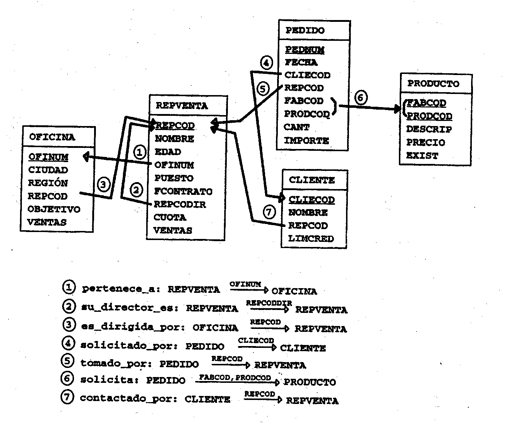

# Cas Representants de vendes (Training)
---
## Descripció de les taules de la base de dades de pràctiques

La base de dades relacional amb la que anem a treballar a les pràctiques
consta de cinc taules: CLIENTE, OFICINA,
PEDIDO, PRODUCTO i REPVENTA.

Els camps de cadascuna d'aquestes taules s'especifiquen a continuació:

CLIENTE( <ins>CLIECOD</ins>, NOMBRE, REPCOD, LIMCRED)

OFICINA(<ins>OFINUM</ins>, CIUDAD, REGION, DIRECTOR, OBJETIVO, VENTAS)

PEDIDO(<ins>PEDNUM</ins>, FECHA, CLIECOD, REPCOD, FABCOD, PRODCOD, CANT, IMPORTE)

PRODUCTO(<ins>FABCOD, PRODCOD</ins>, DESCRIP, PRECIO, EXIST)

REPVENTA(<ins>REPCOD</ins>,NOMBRE, EDAD, OFINUM, PUESTO, FCONTRATO, JEFE,
CUOTA ,VENTAS)

La informació continguda en aquestes taules correspon a una empresa de venda de recanvis. L'empresa té diverses oficines situades a
diferents ciutats. Els empleats són representants que es dediquen a vendre els productes de diferents fabricants als seus clients. A
continuació es detalla la informació continguda a cadascuna de les taules, de manera que es comprendrà millor el funcionament de l'empresa i quines són les dades del vostre interès.

__CLIENTE__: taula amb informació sobre els clients. Cada client té assignat un codi únic CLIECOD. Del client interessa saber el
NOMBRE, el representant (REPCOD) que va contactar amb ell per primera vegada i el límit de crèdit que se li pot concedir (LIMCRED).

__OFICINA__: Conté les dades sobre cadascuna de les oficines que l'empresa té. Cada oficina té assignat un identificador únic OFINUM. D'ella interessa saber-ne el nom, que és el de la CIUTAT en què està situada, la REGIÓ a què ven (Este, Oeste), el representant director de l'oficina i el total acumulat de l'import de les VENTAS realitzades pels representants assignats a aquesta. A més, cada oficina té marcat un OBJECTIVO de venda, que correspon al
total de l'import de les vendes que es pretén assolir pels representants de l'oficina.

__PEDIDO__: Taula on es guarda la informació referent a les comandes realitzades a l'empresa. A cada comanda se li assigna un número
que és únic (PEDNUM). Les dades d'una comanda són les següents: FECHA en què es va prendre la comanda, el client que la va realitzar (CLIECOD), el representant que va fer la venda (REPCOD), el producte sol·licitat (FABCOD, PRODCOD és clau primària), quantitat d'unitats demanades (CANT)
i IMPORTE total de la comanda. A cada comanda se sol·licita un sol tipus de producte.

__PRODUCTO__ Taula que conté les dades sobre els productes que l'empresa ven. Aquests productes li són subministrats per diferents fabricants, cadascun dels quals té un codi diferent (FABCOD).
Cada fabricant utilitza uns codis propis per identificar els seus productes (PRODCOD). Ja que hi ha la possibilitat que dos fabricants diferents
utilitzin els mateixos codis de producte, l'identificador del producto és la suma de tos dos, el de fabricant i el del producte
(FABCOD,PRODCOD), per identificar de manera única els articles que ven. De cada un se'n guarda una descripció (DESCRIP), el PRECIO per unitat i les seves existències que hi ha al magatzem
(EXIST).

__REPVENTA__ és la taula on es guarden els
dades dels representants de l'empresa. Cadascú té assignat un
codi que és únic (REPCOD). Se'n vol saber el NOMBRE, l'EDAD,
l'oficina a què està assignat (OFINUM), el PUESTO que ocupa, la
data de contracte (FCONTRATO), el seu cap, la CUOTA de
vendes a assolir i el total de l'import de les VENTAS que ha
realitzat.



La cardinalitat de totes aquestes relacions és d'un a molts (1:n):

1\. Cada representant pertany a una sola oficina; a cada oficina
treballen diversos representants.
2\. Cada representant pot tenir o no; un representant
pot ser cap de varis representants o de cap.

3\. Cada oficina és dirigida per un sol director; un representant pot
dirigir diverses oficines.

4\. Cada comanda és sol·licitada per un sol client; un client pot
sol·licitar diverses comandes.

5\. Cada comanda és presa per un sol representant; un representant
pot prendre diverses comandes.

6\. Cada comanda sol·licita un sol producte; un producte pot ser
sol·licitat en diverses comandes.

7\. Cada client és contactat per primera vegada per un sol representant;
un representant pot haver contactat per primera vegada amb diversos
clients.

# Exercicis (comenceu per l'apartat `G-DML`)
---
## A. Consultes simples

1\. Obtenir les dades dels productes les existències dels quals estiguin entre 25 i
40 unitats.

2\. Obtenir els codis dels representants que han pres alguna comanda
(evitant-ne la repetició).

3\. Obtenir les dades de les comandes realitzades pel client el
codi és el 2111.

4\. Obtenir les dades de les comandes realitzades pel client el
codi és el 2111 i que han estat presos pel representant el
codi és el 103.

5\. Obtenir les dades de les comandes realitzades pel client el
codi és el 2111, que han estat presos pel representant el codi del qual
és el 103 i que sol·liciten articles del fabricant el codi del qual és ACI.

6\. Obtenir una llista de totes les comandes ordenades per client i, per
cada client, ordenats per la data de la comanda (ascendentment)

7\. Obtenir les dades dels representants que pertanyen a loficina
de codi 12 i 13 (cada representant només pertany a una oficina).

8\. Obtenir les dades de productes dels quals no hi ha existències o bé
aquestes són desconegudes.

9\. Mostrar els representants que van ser contractats el 2003 (sumem
5000 a la data de contracte)

10\. Mostrar el nom i els dies que porta contractats els representants

## B. Consultes Multitaula

1. Mostra dels representants el seu nom, la ciutat de la seva oficina, així com la seva regió.

2. Obtenir una llista de totes les comandes, mostrant el número de
     comanda, el seu import, el nom del client que el va fer i el límit
     de crèdit del client.

3. Obtenir una llista de representants ordenada alfabèticament,
     en què es mostri el nom del representant, codi de la
     oficina on treballa, ciutat i la regió on ven.

4. Obtenir una llista de les oficines (ciutats, no codis) que tenen
     un objectiu superior a 360.000 euros. Per a cada oficina mostrar la
     ciutat, el seu objectiu, el nom del director i lloc del mateix.

5. Obtenir una llista de totes les comandes mostrant el seu número, el
     import i la descripció dels productes sol·licitats.

6. Obtenir una llista de les comandes amb imports superiors
a 4000. Mostrar el nom del client que va sol·licitar la comanda,
número de la comanda, import de la mateixa, la descripció del producte
sol·licitat i el nom del representant que el va prendre. Ordeneu la
llista per client alfabèticament i després per import de més gran a més petit.

7. Obtenir una llista de les comandes amb imports superiors
a 2000 euros, mostrant el número de comanda, import, nom del
client que ho va sol·licitar i el nom del representant que va contactar
amb el client per primera vegada.

8. Obtenir una llista de les comandes amb imports superiors a 150
     euros, mostrant el codi de la comanda, l'import, el nom del
     client que ho va sol·licitar, el nom del representant que va contactar
     amb ell per primera vegada i la ciutat de loficina on el
     representant treballa.

9. Llista les comandes preses durant el mes d'octubre de l'any 2003 ,
     mostrant només el número de la comanda, el seu import, el nom del
     client que ho va realitzar, la data i la descripció del producte
     sol·licitat

10. Obtenir una llista de totes les comandes preses per representants de
     oficines de la regió Est, mostrant només el número del
     comanda, la descripció del producte i el nom del representant
     que ho va prendre

11. Obtenir les comandes preses els mateixos dies en què un nou
     representant va ser contractat. Mostrar número de comanda, import,
     data comanda.

12. Obtenir una llista amb parelles de representants i oficines on
     la quota del representant és més gran o igual que l'objectiu de la
     oficina, sigui o no l'oficina on treballa. Mostra Nom del
     representant, quota del mateix, Ciutat de l'oficina, objectiu de la
     mateixa.

13. Mostra el nom, les vendes i la ciutat de l'oficina de cada
     representant de lempresa.

14. Obtenir una llista de la descripció dels productes per als quals
     existeix alguna comanda en què se sol·licita una quantitat més gran a les
     existències del producte.

15. Llista els noms dels representants que tenen una quota
     superior a la del director.


sdfsdfds

16. Obtenir una llista dels representants que treballen en una oficina
     diferent de l'oficina on treballa el seu director, mostrant
     també el nom del director i el codi de l'oficina on
     treballa cadascun.

17. El mateix exercici anterior, però en comptes d'ofinum, la ciutat.

18. Mostrar el nom i el lloc de què són cap.

## C. Funcions de grup

1\. Mostrar la suma de les quotes i la suma de les vendes totals de
tots els representants.

2\. Quin és l'import total de les comandes preses per Bill Adams?

3\. Calcula el preu mitjà dels productes del fabricant “aci”.

4\. Quin és l'import mitjà de la comanda sol·licitada pel client
"acme mfg."

5\. Mostrar la quota màxima i la quota mínima de les quotes dels
representants.

6\. Quina és la data de la comanda més antiga que es té registrada?

7\. Quin és el millor rendiment de vendes de tots els representants?
(considerar-ho com el percentatge de vendes sobre la quota).

8\. Quants clients té lempresa?

9\. Quants representants han obtingut un import de vendes superior a
la seva pròpia quota?

10\. Quantes comandes s'han pres de més de 150 euros?

11\. Troba el nombre total de comandes, l'import mitjà, l'import total
dels mateixos.

12\. Quants llocs de treball diferents hi ha a l'empresa?

13\. Quantes oficines tenen representants que superen les seves
pròpies quotes?

14\. Quin és l'import mitjà de les comandes preses per cada
representant?

15\. Quin és el rang de les quotes dels representants assignats a
cada oficina (mínim i màxim)?

16\. Quants representants hi ha assignats a cada oficina? Mostra Ciutat
i nombre de representants.

17\. Quants clients ha contactat per primer cop cada representant?
Mostra el codi de representant, nom i número de clients.

18\. Calcula el total de l'import de les comandes sol·licitades per cada
client a cada representant.

19\. Llista l'import total de les comandes preses per cada
representant.

20\. Per a cada oficina amb dos o més representants, calculeu el total de
les quotes i el total de les vendes de tots els representants.

21\. Mostra el nombre de comandes que superen el 75% de les existències.

## D. Subconsultes


0. Mostrar el nom i el lloc dels que són cap (ja està fet amb self join, ara amb subconsultes)

1\. Obtenir una llista dels representants les quotes dels quals són iguals o
superiors a lobjectiu de loficina dAtlanta.

2\. Obtenir una llista de tots els clients (nom) que van ser
contactats per primera vegada per Bill Adams.

3\. Obtenir una llista de tots els productes del fabricant ACI les del qual
existències superen les existències del producte 41004 del mateix
fabricant.

4\. Obtenir una llista dels representants que treballen a les oficines
que han aconseguit superar el seu objectiu de vendes.

5\. Obtenir una llista dels representants que no treballen a les
oficines dirigides per Larry Fitch.

6\. Obtenir una llista de tots els clients que han demanat comandes
del fabricant ACI entre gener i juny del 2003.

7\. Obtenir una llista dels productes dels quals s'ha pres una comanda
de 150 euros o més.

8\. Obtenir una llista dels clients contactats per Sue Smith que no
han sol·licitat comandes amb imports superiors a 18 euros.

9\. Obtenir una llista de les oficines on hi hagi algun representant
la quota del qual sigui més del 55% de l'objectiu de l'oficina. Per comprovar el vostre
exercici, feu una Consulta prèvia el resultat de la qual valideu l'exercici.

10\. Obtenir una llista dels representants que han pres alguna comanda
l'import del qual sigui més del 10% de la seva quota.

11\. Obtenir una llista de les oficines on el total de vendes
dels seus representants han aconseguit un import de vendes que supera el
50% de lobjectiu de loficina. Mostrar també l'objectiu de cada
oficina (suposeu que el camp vendes d'oficina no existeix).

12\. Quina és la descripció del primer producte sol·licitat en una comanda?
13\. Quin representant té el millor percentatge de vendes?

14\. Quin representant té el pitjor percentatge de vendes?

15. Quin producte (Descripció) té més comandes?

16 . Quin producte s'ha venut més?

## E. Intersecció, unió i diferència

1. Obtenir una llista de tots els productes el preu dels quals excedeixi els 20
     euros i dels quals hi ha alguna comanda amb un import superior a 200
     euros.
2. Obtenir una llista de tots els productes el preu dels quals més IVA excedeixi
     de 20 euros o bé hi hagi alguna comanda l'import de la qual més IVA excedeixi els
     180 euros.
3. Obtenir els codis dels representants que són directors de
     oficina i que no han pres cap comanda.
4. Mostrar el representant que ven més i el que ven menys, deixant-lo clarament indicat.


## F. Exercicis Extra

0. Clients que no han fet cap comanda.  
1\. Obtenir una llista amb els noms de les oficines on cap  
representant hagi pres comandes de productes del fabricant BIC.  
2\. Obtenir els noms dels clients que han sol·licitat comandes a
representants d'oficines que venen a la regió Oest o que van ser
contactats per primera vegada pels directors de les oficines esmentades.  
3\. Obtenir els noms dels clients que només han fet comandes al
representant que va contactar amb ells la primera vegada.  
4\. Obtenir els noms dels clients que han sol·licitat tots els seus
comandes a representants que pertanyen a la mateixa oficina.  
5\. Obtenir per a cada oficina la quantitat d'unitats venudes pels seus
representants de productes del fabricant ACI ( de les oficines es
mostra el nom).  
6\. Mostrar una llista amb els noms dels representants juntament amb els
noms dels seus directors. Si un representant no té director,
també ha d'aparèixer a la llista (evidentment, al seu costat no
apareixerà cap nom).  

## G. Exercicis DML

1. El fabricant REI ha fabricat 100 altaveus de 65€, amb codi 3G123
2. Tom Snyder passa a tenir quota, que és equivalent a un 25% del salari.
3. A totes les oficines de l'Oest se'ls apuja el seu objectiu un 15%.
4. Avui es contracta Andrew Bynum, de 30 anys, el seu número de representant és 111, treballa de Rep Ventas i té una quota de 1800. Encara no se sap ni el seu cap ni a quina oficina anirà.
5. La data del contracte de Paul Cruz es modifica i passa a ser el dia 11/12/2013
6. S'acomiada Sue Smith. Per això, ho descomposem en les tasques següents:
   6.1. Crear un 'Sense Representant' per substituir-lo per Sue Smith.
   6.2. Els clients que estaven assignats a Sue Smith passar-los a 'Sense Representant'.
   6.3. Les comandes que estaven realitzades per Sue Smith passar-les a 'Sin Representante'.
   6.4. La/les oficina/es que tenia assignada a Sue Smith passar-la a 'Sense Representant'.
   6.5. S'acomiada a Sue Smith.

## H. Més exercicis

1. Muestra los pedidos que han sido tomados por el mismo representante que contactó por primera vez con el cliente.
2. TOP 5 de los que tienen mejor rendimiento.
3. Mostrar por cada oficina, su mejor vendedor.
4. TOP 5 de los que tienen peor rendimiento.
5. Mostrar para cada jefe, cuantos empleados directos tiene a su cargo.

## I. Vistes

Creeu una vista anomenada "rendiment" on ha de sortir per a cada representant el seu nom, la ciutat
de l'oficina on treballa i el seu rendiment (el que ha venut sobre el que ha de vendre) expressat com un text, de la següent manera:

* Per sota del 50% (inclòs) >= "Rendiment baix"
* A partir del 50 fins el 75% inclòs => "Rendiment mitjà"
* A partir del 75% fins el 100% => "Rendiment alt"
* A partir del 1800 => "Rendiment excel·lent"

## J. Funcions (__funcionsTraining.sql__)

Caldrà veure si cal crear seqüències per les claus primàries.

Per crear una seqüència per una clau primària d'una taula, la podeu inicialitzar a 1. Però com que en el nostre cas ja tenim dades a les taules, és imprescindible fer a continuació el següent (us poso exemple de la taula client):

```
select setval('cliecod_seq', (select max(cliecod) from cliente), true);
```
Aquesta sentència farà que la propera vegada que demanem el següent valor de la seqüència torni max+1, ja que tenim com a tercer paràmetre true [sequence functions](https://www.postgresql.org/docs/current/functions-sequence.html)

`Nota`: Les seqúències s'han de crear __obligatòriament__ fora de les funcions

**Funció**|`existeixClient`
---|---
Paràmetres|p_cliecod  
Tasca|comprova si existeix el client passat com argument  
Retorna|booleà

**Funció**|`altaClient`
---|---  
Paràmetres|p_nombre ,p_repcod, p_limcred
Tasca|Donarà d’alta un client
Retorna|Missatge _Client X s’ha donat d’alta correctament_
Nota| si no està creada, creem una seqüència per donar valors a la clau primària. Començarà en el següent valor que hi hagi a la base de dades.

**Funció**|`stockOk`
---|---
Paràmetres|p_cant , p_fabcod,p_prodcod
Tasca|Comprova que hi ha prou existències del producte demanat.
Retorna|booleà

**Funció**|`altaComanda`
---|---
Paràmetres| Segons els exercicis anteriors i segons necessitat, definiu vosaltres els paràmetres mínims que necessita la funció, tenint en compte que cal contemplar l'opció per defecte de no posar data, amb el què agafarà la data de sistema. Si no hi és, creeu una seqüència per la clau primària de pedido.  
Tasca| Per poder donar d'alta una comanda es tindrà que comprovar que existeix el client i que hi ha prou existències. En aquesta funció heu d'utilitzar les funcions  existeixClient i stockOK (recordeu de no posar `select function(...` ). Evidentment, s'haura de calcular el preu de l'import en funció del preu unitari i de la quantitat d'unitats.  
Retorna|missatge indicant el que ha passat  


**Funció**|`preuSenseIVA`
---|---
Paràmetres| p_precio (preu `amb` IVA)
Tasca| Donat un preu amb IVA, es calcularà el preu *sense* IVA (es considera un 21 % d'IVA) i serà retornat.

**Funció**|`preuAmbIVA`
---|---
Paràmetres| p_precio (preu `sense` IVA)
Tasca| Donat un preu sense IVA, es calcularà el preu *amb* IVA (es considera un 21 % d'IVA) i serà retornat.

# K. Triggers (__triggersTraining.sql__)

1. Implementeu el trigger `tActualitzarVendes` el qual es dispararà quan es fagi una nova comanda. Haurà d'actualitzar els camps calculats vendes de les taules repventa i oficina.

2. Implementeu el trigger `tControlProducte` per impedir fer qualsevol operació DML sobre la taula pedido fora de l'horari comercial (de dilluns a divendres de 9 a 14 i de 17-20, dissabtes de 10-14h). Proveu la funció to_char amb una data i el patró `d`.
